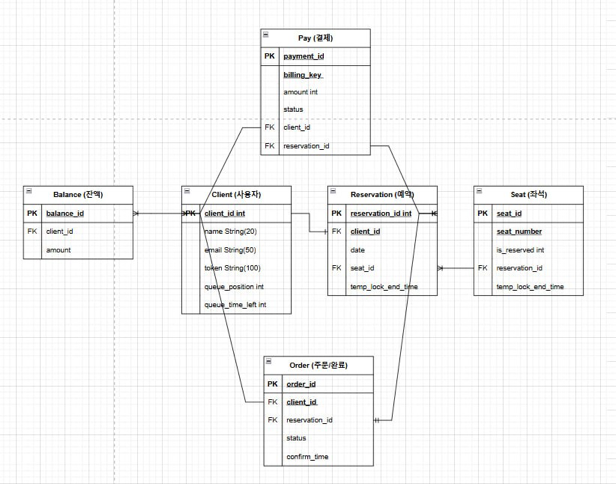

# ERD


# API 명세서
API 명세서
1. 유저 대기열 토큰 발급
   - POST /api/v1/queue/token
   - 설명: 사용자가 대기열에 추가되며, 이때 토큰을 발급받습니다.
   - 요청 본문 (Request Body):
      ```
      {
      "clientId": "1"
      }
      ```
   - 응답 (Response):
      - 200 OK:
      ```
      {
      "token": "123123",
      "queuePosition": 5,
      "queueTimeLeft": "00:15:00"
      }
      ```
      - 400 Bad Request: 이미 대기열에 있을 경우
      ```
      {
      "error": "유저 대기열에 있음"
      }
      ```
2. 대기열 상태 조회
   - GET /api/v1/queue/status
   - 설명: 대기열에 있는 사용자의 상태를 조회한다
   - 요청 파라미터 (Request Params):
     - token (string): 발급된 대기열 토큰
     - 응답 (Response):
       - 200 OK:
       ```
       {
       "queuePosition": 5,
       "queueTimeLeft": "00:10:00"
       }
       ```
       - 404 Not Found: 대기열에 없는 경우
       ```
       {
       "error": "유저 대기열에 없음"
       }
       ```
3. 예약 가능한 날짜 조회
   - GET /api/v1/reservation/dates
   - 설명: 예약 가능한 날짜 목록을 반환
   - 응답 (Response):
     - 200 OK:
     ```
     {
     "availableDates": [
     "2024-10-15",
     "2024-10-16",
     "2024-10-17"
     ]
     }
     ```
     - 500 Internal Server Error: 날짜 조회 중 에러가 발생한 경우
     ```
     {
     "error": "날짜 없음"
     }
     ```
4. 특정 날짜의 좌석 조회
   - GET /api/v1/reservation/seats
   - 설명: 특정 날짜에 예약 가능한 좌석 목록을 조회
   - 요청 파라미터 (Request Params):
     - date (string): 예약하고자 하는 날짜 (예: 2024-10-15)
   - 응답 (Response):
     - 200 OK:
     ```
     {
     "availableSeats": [
     {"seatNumber": 1, "isReserved": false},
     {"seatNumber": 2, "isReserved": false},
     {"seatNumber": 3, "isReserved": true},
     ]
     }
     ```
     - 404 Not Found: 해당 날짜에 좌석이 없는 경우
     ```
     {
     "error": "그 날짜에 좌석이 없음"
     }
     ```
5. 좌석 예약 요청 및 임시 배정
   - POST /api/v1/reservation
   - 설명: 특정 날짜와 좌석을 입력하면 좌석 예약을 처리
   - 요청 본문 (Request Body):
   ```
   {
   "clientId": "string",
   "date": "2024-10-15",
   "seatNumber": 5
   }
   ```
   - 응답 (Response):
     - 200 OK:
     ```
     {
     "reservationId": "string",
     "seatNumber": 5,
     "status": 2,
     "tempLockEndTime": "2024-10-15T15:30:00"
     }
     ```
     - 409 Conflict: 좌석이 이미 예약된 경우
     ```
     {
     "error": "이미 선택된 좌석입니다."
     }
     ```
6. 잔액 충전
   - POST /api/v1/balance/charge
   - 설명: 사용자의 잔액 충전
   - 요청 본문 (Request Body):
   ```
   {
   "clientId": "string",
   "amount": 10000
   }
   ```
   - 응답 (Response):
      - 200 OK:
      ```
      {
      "clientId": "1",
      "newBalance": 50000
      }
      ```
      - 400 Bad Request: 유효하지 않은 금액 입력 시
      ```
      {
      "error": "금액이 올바르지 않습니다."
      }
      ```
7. 잔액 조회
   - GET /api/v1/balance
   - 설명: 사용자의 잔액 조회
   - 요청 파라미터 (Request Params):
     - clientId (string): 사용자 식별자
   - 응답 (Response):
     - 200 OK:
     ```
     {
     "clientId": "1",
     "balance": 140000
     }
     ```
     - 404 Not Found: 잔액이 존재하지 않는 경우
     ```
     {
     "error": "잔액이 없음"
     }
8. 결제 처리
   - POST /api/v1/payment
   - 설명: 사용자의 예약에 대해 결제를 처리하고, 좌석 소유권을 배정한다.
     - 요청 본문 (Request Body):
     ```
     {
     "clientId": "1",
     "reservationId": "2",
     "amount": 140000
     }
     ```
   - 응답 (Response):
     - 200 OK:
     ```
     {
     "paymentId": "4",
     "status": "SUCCESS",
     "seatNumber": 5
     }
     ```
     - 400 Bad Request: 잔액 부족 시
     ```
     {
     "error": "금액이 부족합니다."
     }
     ```
9. 주문 상태 확인
   - GET /api/v1/order
   - 설명: 결제 완료 후 주문 상태 확인
   - 요청 파라미터 (Request Params):
     - reservationId (string): 예약 식별자
   - 응답 (Response):
     - 200 OK:
       ```
       {
       "reservationId": "2",
       "status": "CONFIRMED",
       "confirmTime": "2024-10-15T15:35:00"
       }
       ```
       - 404 Not Found: 주문이 존재하지 않는 경우
       ```
       {
       "error": "주문이 존재하지 않습니다"
       }
       ```
10. 좌석 임시 배정 해제
    - POST /api/v1/reservation/release
    - 설명: 결제가 완료되지 않으면 좌석의 임시 배정을 해제
    - 요청 본문 (Request Body):
      ```
      {
      "reservationId": "2"
      }
      ```
    - 응답 (Response):
      - 200 OK:
      ```
      {
      "reservationId": "2",
      "status": "CANCELED"
      }
      ```
      - 404 Not Found: 예약이 존재하지 않는 경우
      ```
      {
      "error": "예약이 존재하지 않습니다."
      }
      ```

